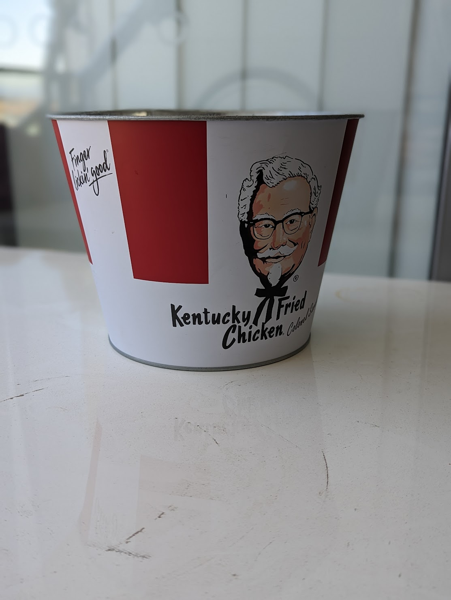
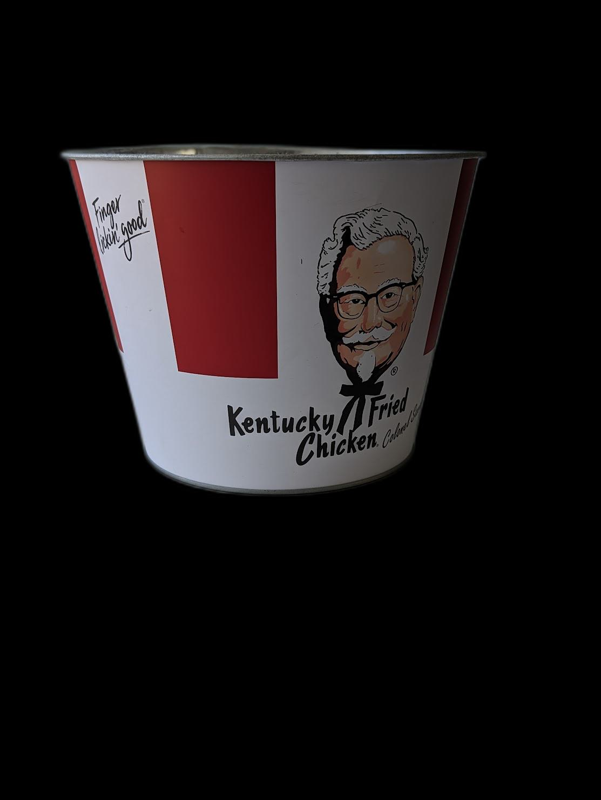

# PhotoToVolume
This python script will let you convert a photo of a flower pot to volume (given the width and height
PhotoToVolume
PhotoToVolume is a Python application that calculates the volume of a pot based on an input image. It utilizes image processing techniques, contour extraction, interpolation, and mathematical modeling to estimate the pot's volume.

Dependencies
cv2
numpy
matplotlib
Pillow
scipy
rembg
These dependencies can be installed by running the following command:

Copy code
pip install -r requirements.txt
or
conda env create -f environment.txt

Usage
Prepare the input image by removing the background and saving the cropped pot image to the images directory. You can use the prep_image() function provided in the code.

Call the calculate_volume_from_image() function to calculate the volume of the pot based on the cropped image.

python
Copy code
volume_litres = calculate_volume_from_image()
print("Volume in Liters:", volume_litres)
The calculated volume in liters will be displayed in the console.
Customization
You can modify the constants POT_HEIGHT_CM and POT_WIDTH_CM in the code to match the dimensions of your pot.

Adjust the degree of the polynomial fit by modifying the degree variable in the calculate_volume() function.

Feel free to explore and customize other parts of the code to suit your specific requirements.

License
This project is licensed under the MIT License.

Feel free to use, modify, and distribute the code as needed.

Acknowledgments
The code in this project is based on various image processing and mathematical modeling techniques.

Special thanks to the developers of the dependencies used in this project for their valuable contributions.

Please note that this project provides an estimation of the pot's volume based on image analysis. The accuracy of the estimation may vary depending on the quality of the input image and the assumptions made during the modeling process.
